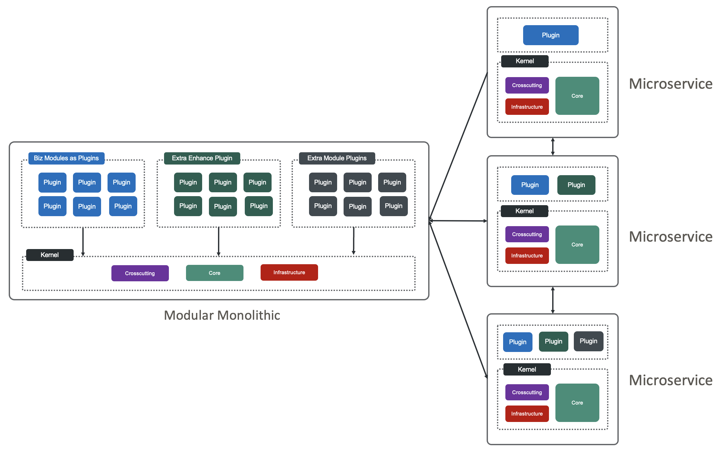
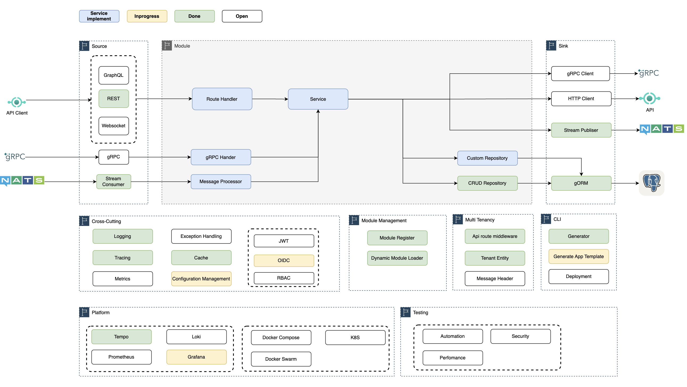

# eBrick Framework

## Elastic Architecture Overview

Elastic Architecture is a software design approach that emphasizes flexibility, adaptability, and scalability by combining the strengths of modular monolithic, kernel, and microservice architectures. This approach allows the system to easily expand, contract, or transition between different architectural models based on business and technical requirements without significantly affecting its integrity and performance. 

[Elastic Architecture](docs/Elastic-Architecture.md)

## eBrick Framework Overview

**eBrick Framework** – a robust and flexible platform designed for building Elastic Applications which inspired by elastic architecture. The eBrick Framework leverages a brick architecture, seamlessly combining modular components, microservices, and a core kernel to facilitate the development of scalable and adaptable software solutions. Integrating the principles of clean architecture, eBrick ensures each layer of your application remains decoupled and maintainable, allowing for easy modifications, testing, and deployment.

### Key Feature: Seamless Transition Between Architectures

One of the standout features of eBrick is its ability to support seamless **transitions between monolithic and microservices architectures** . You can start by building a monolithic application where all modules are integrated into a single, unified system. As your application grows, eBrick’s **plug-and-play** capability allows you to effortlessly transition to a microservices architecture, where **each service contains one or more module**s. If needed, you can just as easily transition back to a monolithic architecture, reintegrating the services into a single application. This flexibility ensures your application can evolve with your business needs, scaling up, breaking down, or consolidating as necessary—all without extensive rewrites or disruptions.

### Additionally, eBrick comes with out-of-the-box support for

- **Observability with OpenTelemetry**: Seamlessly monitor and trace your applications to ensure optimal performance and reliability.
- **Messaging with NATS JetStream**: Efficiently handle messaging across your microservices with a robust and scalable messaging system.
- **API Handling with Gin**: Develop high-performance APIs using the Gin framework, known for its speed and flexibility.
- **ORM with GORM**: Simplify database interactions with GORM, a powerful and developer-friendly ORM for Golang.
- **Multi-Tenancy**: Support multiple tenants within a single application instance, ensuring isolated and secure data handling for each tenant.

With eBrick, you’re equipped to build highly resilient, flexible, and observable applications that can easily adapt to your changing requirements, making it the ideal framework for dynamic and growing environments.
